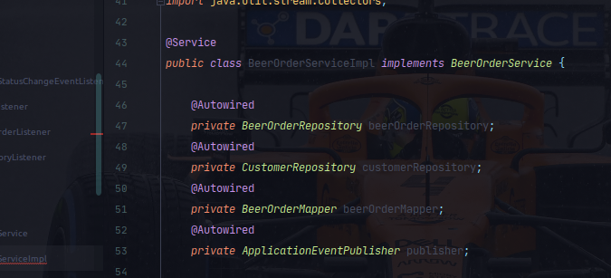
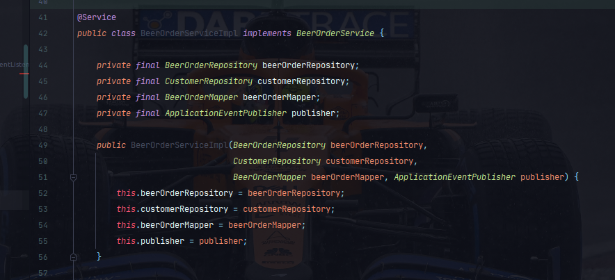
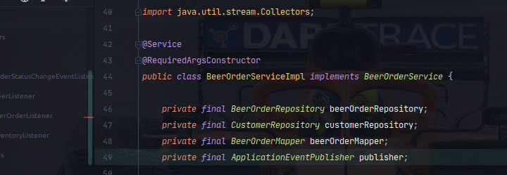
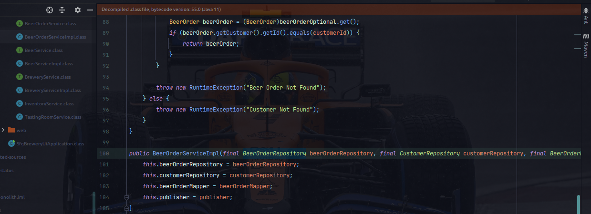
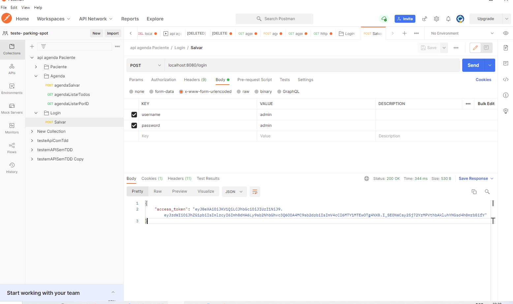
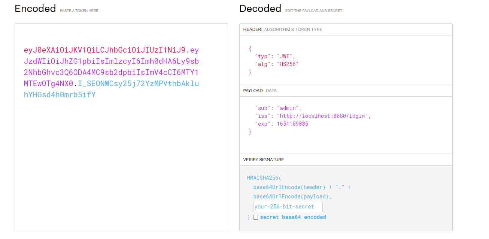

## Tabelas

CREATE TABLE agenda(
id serial primary key,
descricao varchar (255),
data_hora timestamp,
data_criacao timestamp,
paciente_id integer,
CONSTRAINT fk_agenda_paciente FOREIGN KEY(paciente_id) REFERENCES paciente(id)
);

CREATE TABLE paciente(
id serial primary key,
nome varchar (50),
sobrenome varchar (100),
cpf varchar(50),
email varchar (100)
);
##Por que ModelMapper?

O objetivo do ModelMapper é facilitar o mapeamento de objetos, determinando automaticamente como um modelo de objeto é 
mapeado para outro, com base em convenções, da mesma forma que um humano faria - enquanto fornece uma API simples e 
segura para refatoração para lidar com casos de uso específicos

##@RequiredArgsConstructor

Muita gente usa do @Autowired pra fazer essas injeções de dependências, da seguinte forma:

O lado ruim de injetar dessa forma é que isso pode te atrapalhar quanto a fazer código de teste, uma vez que vai ser 
complicado de mockar as dependências para testar a classe.

Uma forma de resolver esse problema é usufruindo das habilidades do Spring Boot e criando um construtor que receba essas
dependências como parâmetro:

É ai que entra o RequiredArgsConstructor !!

e ai em tempo de compilação o Lombok vai criar um construtor com as dependências necessárias, removendo toda a
necessidade de escrever todo o código anterior para usufruir da injeção de dependência do Spring:

após compilar o projeto, abri o .class da classe em questão, e no fim do arquivo o Lombok adicionou o construtor com
todas as dependências necessárias

## por que anotar com
@Component: é um estereótipo genérico para qualquer componente gerenciado pelo Spring;

Podemos usar o @Component no aplicativo para marcar os beans como componentes gerenciados do Spring. O Spring apenas
registra beans com @Component sem procurar por @Service e @Repository os quais são registrados no ApplicationContext
porque são anotados com @Component ,

@Service faz anotações de classes na camada de serviço;
@Repository anota classes na camada de persistência, que atuará como um repositório de banco de dados;

Diferenças entre @Component, @Service e @Repository
A principal diferença entre esses estereótipos é que eles são usados para diferentes classificações.

Quando anotamos uma classe para detecção automática, devemos usar o respectivo estereótipo.

@Componente
Podemos usar o @Component no aplicativo para marcar os beans como componentes gerenciados do Spring. O Spring apenas 
registra beans com @Component sem procurar por @Service e @Repository os quais são registrados no ApplicationContext 
porque são anotados com @Component.

@Service e @Repository são componentes especíais de @Component. Tecnicamente são iguais, mas utilizados para diferentes casos.

@Repositório
O @Repository tem como objetivo criar beans para a parte de persistência, além de capturar exceções específicas de 
persistência e repeti-las novamente como uma das exceções não verificadas e unificadas do Spring.

@Service
Marcamos beans com @Service para indicar que ele está mantendo a lógica de negócios. Não há outra especialidade, além 
do uso na camada de serviço.

#Swagger

http://localhost:8080/swagger-ui/#/

## Spring Boot 2,
https://howtodoinjava.com/spring-boot2/testing/spring-boot-mockito-junit-example/

##Processo para incluir Segurança

senha para autorizar gerada na hora quando rodo o spring

Possui uma camada antes por isso não é possivel executar pelo o POSTMAN, pois o Spring Security criou uma camada para proteção

Para gerar o token foi usado o JWT - https://jwt.io/#debugger-io
primeiro fiz um POST com o usuario e senha ele gerou o token

copiei o tken do postman e joguei no JWT (adicionamos 10 minutos para esse token)

foi criado outro filtro para validar o token

## O que é Flyway

- ferramenta de migração de banco de dados
- Controle de versão para banco de dados
- Verssiono junto com o código

 **Comandos básicos**

haverá uma pasta na aplicação que por padrão é a db.migration
- Migrate(migro o código para a versão mais atual do script)
- Clean(limpa todo o banco de dados)
- Info(vai ter um objeto que vai dizer se existe alguma coisa pendente)
- Validate(valida se o bd esta aderente as migrações - valida se a tabela está condizente com o modelo atual)
- Undo(desfaz a migração - apenas no interprise e não é indicado pelo o flyway)
- Baseline(se vc já tem o banco e indica que apartir de um momento usar)
- Repair( corrige as tableas de histórico)

## Artigos Interessantes

https://www.linkedin.com/pulse/limpando-ainda-mais-seu-c%C3%B3digo-spring-boot-com-denis-caminha/?originalSubdomain=pt

http://modelmapper.org/

https://receitasdecodigo.com.br/spring-framework/component-repository-service-em-spring#:~:text=Podemos%20usar%20o%20%40Component%20no,%2F%2F%20%5B...%5D